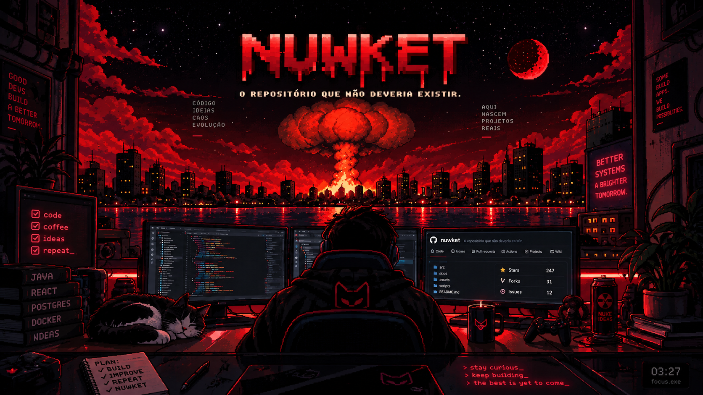

<!-- =========================================================
     NUWKET PROFILE
     mortality:false
     process:still_running
     ========================================================= -->

  

<!-- ─────────────────────────────────────────────────────── -->

  

  <code>☢ SIGNAL: UNSTABLE</code>
  &nbsp;&nbsp;•&nbsp;&nbsp;
  <code>PROCESS: RUNNING</code>
  &nbsp;&nbsp;•&nbsp;&nbsp;
  <code>ORIGIN: /dev/soul</code>
  &nbsp;&nbsp;•&nbsp;&nbsp;
  <code>CONTAINMENT: FAILED</code>

 

  

 
